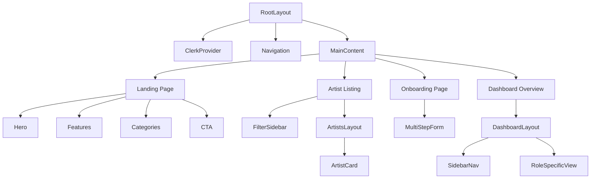

# Artistly Platform - Comprehensive Overview

Artistly is a high-performance, professional artist booking platform designed to connect talented performers (singers, dancers, DJs, musicians, etc.) with event organizers. The project utilizes a modern tech stack with a focus on data-driven dynamic interactions and a bold **Neo-Brutalism Dark** aesthetic.

---

## 🚀 Tech Stack

- **Core Framework:** [Next.js 14 (App Router)](https://nextjs.org/)
- **Language:** [TypeScript](https://www.typescriptlang.org/)
- **Authentication:** [Clerk](https://clerk.com/)
- **Database & ORM:** [PostgreSQL](https://www.postgresql.org/) with [Prisma](https://www.prisma.io/)
- **Styling:** [Tailwind CSS](https://tailwindcss.com/)
- **Animations:** [Framer Motion](https://www.framer.com/motion/)
- **Icons:** [Lucide React](https://lucide.dev/)
- **Components:** [Shadcn/ui](https://ui.shadcn.com/) (Radix UI)

---

## 📂 Project Structure & File Hierarchy

### 1. Database Layer (`/prisma`)
*   **[schema.prisma](file:///Users/vaibhavranghar/Desktop/untitled_folder/artistly-platform/prisma/schema.prisma):** The single source of truth for the data model.
    *   **User:** Core user identity linked to Clerk.
    *   **ArtistProfile:** Multi-tenant profile containing bio, skills, portfolio, and ratings.
    *   **HirerProfile:** Profile for event organizers.
    *   **Service:** Gigs offered by artists (e.g., "90min DJ Set").
    *   **Event:** Events created by hirers that need artists.
    *   **Order:** Transactional record connecting a Hirer, Artist, and Service.
    *   **Review:** Feedback loop for completed gigs.

### 2. Core Application Logic (`/src/app`)
*   **[layout.tsx](file:///Users/vaibhavranghar/Desktop/untitled_folder/artistly-platform/src/app/layout.tsx):** Root layout wrapping the app in:
    *   `ClerkProvider`: Strategic authentication layer.
    *   `ThemeProvider`: UI state management for dark mode.
    *   `ArtistProvider`: Context for client-side artist state.
    *   `Navigation`: Global header component.
*   **[page.tsx](file:///Users/vaibhavranghar/Desktop/untitled_folder/artistly-platform/src/app/page.tsx):** The landing page. Composed of modular sections: `Hero`, `Features`, `Categories`, and `CTA`.
*   **[middleware.ts](file:///Users/vaibhavranghar/Desktop/untitled_folder/artistly-platform/src/middleware.ts):** Security layer. Protects `/dashboard` routes and enforces an **onboarding-first** policy for new users.
*   **`/onboarding` [page.tsx](file:///Users/vaibhavranghar/Desktop/untitled_folder/artistly-platform/src/app/onboarding/page.tsx):** A multi-step, animated onboarding experience where users choose their `Role` (`ARTIST` or `HIRER`).

### 3. Role-Based Dashboards (`/src/app/dashboard`)
*   **[page.tsx](file:///Users/vaibhavranghar/Desktop/untitled_folder/artistly-platform/src/app/dashboard/page.tsx):** A smart redirector that routes users to `/dashboard/artist`, `/dashboard/hirer`, or `/dashboard/admin` based on their session metadata.
*   **`/artist` [page.tsx](file:///Users/vaibhavranghar/Desktop/untitled_folder/artistly-platform/src/app/dashboard/artist/page.tsx):** High-level overview for artists showing earnings, gig counts, and active orders.
*   **`/hirer` [page.tsx](file:///Users/vaibhavranghar/Desktop/untitled_folder/artistly-platform/src/app/dashboard/hirer/page.tsx):** Overview for event organizers to track active events and bookings.

### 4. Marketplace Features (`/src/app/artists`)
*   **[page.tsx](file:///Users/vaibhavranghar/Desktop/untitled_folder/artistly-platform/src/app/artists/page.tsx):** The "Find Artists" discovery engine. Implements server-side filtering using Prisma based on URL `searchParams`.
*   **`/[id]/page.tsx`:** Dynamic route for individual artist profiles, showcasing their specific services and portfolio.

### 5. Server Actions (`/src/lib/actions`)
*   **[user-actions.ts](file:///Users/vaibhavranghar/Desktop/untitled_folder/artistly-platform/src/lib/actions/user-actions.ts):** Secure, server-side functions for:
    *   `onboardUser`: Syncing Clerk meta-data and Prisma profiles.
    *   `createGig`: Allowing artists to list new services.
    *   `createEvent`: Allowing hirers to post job opportunities.

### 6. UI & Components (`/src/components`)
*   **[navigation.tsx](file:///Users/vaibhavranghar/Desktop/untitled_folder/artistly-platform/src/components/navigation.tsx):** Context-aware navbar using Clerk's `SignedIn`/`SignedOut` components.
*   **[dashboard/dashboard-layout.tsx](file:///Users/vaibhavranghar/Desktop/untitled_folder/artistly-platform/src/components/dashboard/dashboard-layout.tsx):** A persistent sidebar layout that swaps links and colors based on whether the user is an `ARTIST` or `HIRER`.
*   **`filter-sidebar.tsx` & `artist-card.tsx`:** Modular components used to build the search interface.

---

## 🧩 Component Relationships & Context

### Component Hierarchy (Simplified)

### Context API Strategy
- **`ArtistProvider`**: Used primarily to manage the local state of artist listings and allow for "Favoriting" or optimistic updates before the database reflects the change.
- **`ThemeProvider`**: Injects Neo-Brutalism CSS variables globally for consistent branding.

---

## 🤖 AI Context & Development Notes

- **Data Fetching:** The project prefers **Server Components** for data fetching (using Prisma directly) to minimize client-side waterfall requests.
- **State Management:** Complex forms (like Onboarding) use local `useState` combined with **Server Actions** (`use server`) for persistence.
- **Design System:** The UI is defined by utility classes in `globals.css`. It uses heavy borders, sharp shadows (`brutal-shadow`), and high-contrast colors (`--primary`: yellow, `--accent`: pink).
- **Authentication Flow:** 
  1. User signs up via Clerk.
  2. Middleware detects missing `role` in metadata.
  3. Redirect to `/onboarding`.
  4. Onboarding action updates database + Clerk metadata.
  5. User is granted access to `/dashboard`.

---

## 🛠 Setup & Commands

1. **Install Dependencies:** `npm install`
2. **Database Sync:** `npx prisma db push`
3. **Environment Variables:**
   - `DATABASE_URL`: PostgreSQL connection string.
   - `NEXT_PUBLIC_CLERK_PUBLISHABLE_KEY`: Clerk auth key.
   - `CLERK_SECRET_KEY`: Clerk private key.
4. **Development:** `npm run dev`
