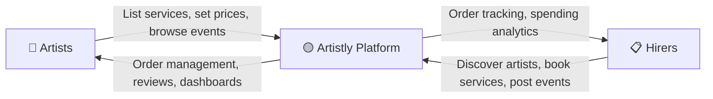
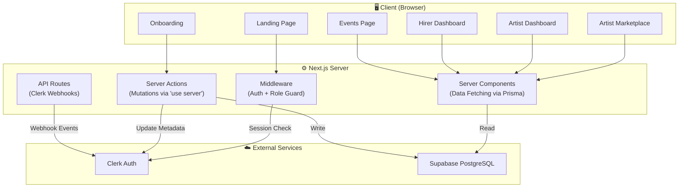
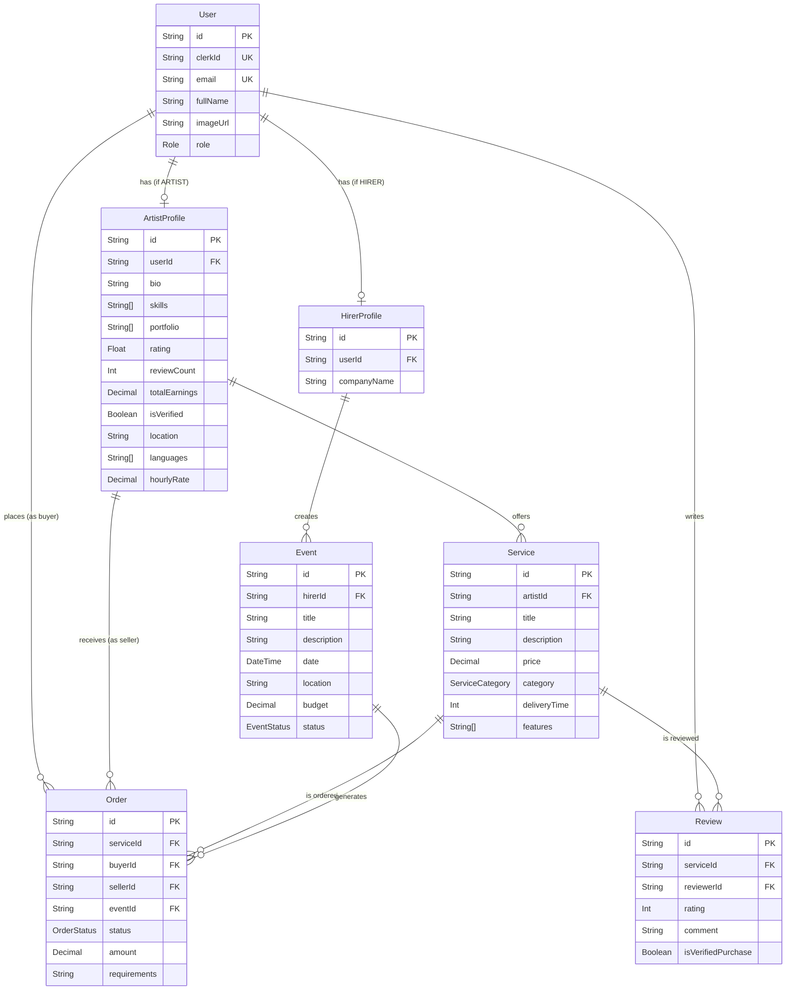
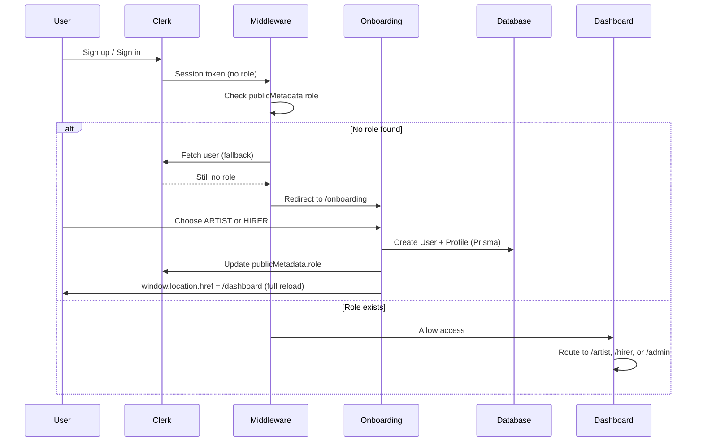

# 🎨 Artistly Platform — Comprehensive Project Analysis

> **Repository**: `artistly-platform`
> **Framework**: Next.js 15 (App Router) · TypeScript · PostgreSQL · Prisma · Clerk Auth
> **Live URL**: [https://artistly-799l.vercel.app/](https://artistly-799l.vercel.app/)

---

## Table of Contents

1. [The Problem](#1-the-problem)
2. [The Solution — What Artistly Does](#2-the-solution--what-artistly-does)
3. [Target Users](#3-target-users)
4. [Technology Stack](#4-technology-stack)
5. [Architecture Overview](#5-architecture-overview)
6. [Database Design (Prisma Schema)](#6-database-design-prisma-schema)
7. [Authentication & Authorization Flow](#7-authentication--authorization-flow)
8. [Feature Breakdown — By User Role](#8-feature-breakdown--by-user-role)
9. [Complete File Structure](#9-complete-file-structure)
10. [Design System — Neo-Brutalism Dark](#10-design-system--neo-brutalism-dark)
11. [Server Actions & Business Logic](#11-server-actions--business-logic)
12. [Performance Optimizations](#12-performance-optimizations)
13. [Security Practices](#13-security-practices)
14. [Deployment & Environment](#14-deployment--environment)
15. [Future Improvement Areas](#15-future-improvement-areas)
16. [Summary](#16-summary)

---

## 1. The Problem

### The Gap in the Live Entertainment Market

Booking live performers for events (weddings, corporate functions, festivals, private parties) is a fragmented, opaque, and frustrating experience for both sides of the transaction:

| Pain Point | Who Suffers | Details |
|---|---|---|
| **Discovery is hard** | Event Organizers (Hirers) | There's no single, searchable marketplace for singers, dancers, DJs, speakers, musicians, and magicians. Organizers rely on word-of-mouth, social media DMs, or expensive talent agencies. |
| **No pricing transparency** | Both | Performers don't advertise rates publicly, leading to awkward negotiation loops. Organizers have no way to compare pricing across similar artists. |
| **No professional profiles** | Artists | Independent artists lack a unified, branded platform to showcase their portfolio, skills, languages, and services. Instagram/YouTube profiles aren't designed for business transactions. |
| **Trust & verification** | Both | No system of reviews, verified purchases, or profile verification exists outside of major agencies. Hirers take a gamble; artists risk non-payment. |
| **Manual booking process** | Both | Bookings happen over email/WhatsApp with no order tracking, status updates, or centralized history. Disputes are common. |
| **Event-to-artist matching** | Artists | Artists have no way to proactively discover events that need their talent type, location, or price range. They wait passively for inbound requests. |

### In Short

> **There is no "Fiverr for live performers."** The entertainment booking industry is stuck in the pre-marketplace era — scattered, manual, and trust-deficient.

---

## 2. The Solution — What Artistly Does

Artistly is a **two-sided marketplace platform** that directly connects **performing artists** with **event organizers (hirers)**, providing:



### Core Value Propositions

| For Artists | For Hirers |
|---|---|
| **Create a professional profile** with bio, skills, portfolio, location, and languages | **Discover artists** via a searchable marketplace with category and price filters |
| **List services (gigs)** with transparent pricing, delivery times, and categories | **Book artists directly** through a structured order flow |
| **Browse & apply to events** posted by hirers — proactive gig acquisition | **Post events** and receive applications from interested artists |
| **Track earnings, orders, and ratings** via a dedicated dashboard | **Manage bookings, events, and spending** from a hirer dashboard |
| **Receive verified reviews** from hirers after completed orders | **Leave reviews** for artists after completed gigs |

### What Makes It Different

- **Role-based onboarding**: Every user chooses ARTIST or HIRER during a multi-step, animated onboarding flow — the platform adapts entirely to their role
- **Bidirectional marketplace**: Hirers can book artists, AND artists can express interest in events — creating liquidity on both sides
- **Structured order lifecycle**: `PENDING → IN_PROGRESS → DELIVERED → COMPLETED` with timestamps and dispute handling
- **Bold Neo-Brutalism UI**: A striking, memorable dark design with sharp borders, electric yellow (`#f5e642`), hot pink (`#ff2a6d`), and cyan (`#00ffcc`) accents

---

## 3. Target Users

### 🎤 Artists (Supply Side)

| Persona | Examples |
|---|---|
| Independent singers & vocalists | Wedding singers, jazz performers, cover artists |
| Dancers | Bollywood, contemporary, hip-hop, flamenco troupes |
| DJs | Club DJs, wedding DJs, corporate event DJs |
| Motivational speakers | Corporate event speakers, panel moderators |
| Musicians | Violinists, pianists, bands, classical ensembles |
| Magicians & specialty acts | Stage magicians, close-up magic, variety acts |

### 📋 Hirers (Demand Side)

| Persona | Examples |
|---|---|
| Event planners | Wedding planners, corporate event coordinators |
| Individuals | People planning birthday parties, anniversary events |
| Companies | HR teams booking entertainment for offsites, launches |
| Venues | Restaurants, bars, hotels seeking regular performers |

---

## 4. Technology Stack

| Layer | Technology | Purpose |
|---|---|---|
| **Framework** | [Next.js 15](file:///Users/vaibhavranghar/Desktop/untitled_folder/artistly-platform/package.json) (App Router, Turbopack) | Full-stack React framework with server components, server actions, file-based routing |
| **Language** | TypeScript | Type-safe development across client and server |
| **Authentication** | [Clerk](file:///Users/vaibhavranghar/Desktop/untitled_folder/artistly-platform/package.json#L12) v6.14 | User sign-up/sign-in, session management, public metadata for role storage |
| **Database** | PostgreSQL (via Supabase) | Relational data storage |
| **ORM** | [Prisma](file:///Users/vaibhavranghar/Desktop/untitled_folder/artistly-platform/prisma/schema.prisma) v6.3 | Type-safe database queries, schema management, migrations |
| **Styling** | [Tailwind CSS](file:///Users/vaibhavranghar/Desktop/untitled_folder/artistly-platform/tailwind.config.js) v3.3 | Utility-first CSS framework |
| **Animations** | [Framer Motion](file:///Users/vaibhavranghar/Desktop/untitled_folder/artistly-platform/package.json#L18) v12 | Page transitions, staggered animations, mobile menu |
| **UI Components** | [Radix UI](file:///Users/vaibhavranghar/Desktop/untitled_folder/artistly-platform/package.json#L20) / Shadcn | Accessible, unstyled primitives (Select, Checkbox, Dropdown, etc.) |
| **Validation** | [Zod](file:///Users/vaibhavranghar/Desktop/untitled_folder/artistly-platform/package.json#L27) v4 | Schema validation for all server actions |
| **Icons** | [Lucide React](file:///Users/vaibhavranghar/Desktop/untitled_folder/artistly-platform/package.json#L17) | Consistent icon library |
| **Forms** | [React Hook Form](file:///Users/vaibhavranghar/Desktop/untitled_folder/artistly-platform/package.json#L23) | Performant form handling |
| **Webhooks** | [Svix](file:///Users/vaibhavranghar/Desktop/untitled_folder/artistly-platform/package.json#L24) | Clerk webhook verification |
| **Deployment** | Vercel | Serverless deployment with edge functions |

---

## 5. Architecture Overview

### High-Level Data Flow



### Rendering Strategy

| Page | Rendering | Reason |
|---|---|---|
| Landing page (`/`) | Server Component | Static content, fast FCP |
| Artist marketplace (`/artists`) | Server Component | Server-side filtering via URL search params |
| Artist profile (`/artists/[id]`) | Server Component | Dynamic data, SEO-friendly |
| Onboarding (`/onboarding`) | Client Component (`"use client"`) | Multi-step interactive form with state |
| Dashboards (`/dashboard/*`) | Server Component | Real-time stats from database |
| Navigation | Client Component | Interactive menu, auth state |
| Filter sidebar | Client Component | Client-side URL manipulation with `useTransition` |

---

## 6. Database Design (Prisma Schema)

The data model in [schema.prisma](file:///Users/vaibhavranghar/Desktop/untitled_folder/artistly-platform/prisma/schema.prisma) consists of **7 models** and **4 enums**:

### Entity-Relationship Diagram



### Enums

| Enum | Values | Purpose |
|---|---|---|
| `Role` | `USER`, `ARTIST`, `HIRER`, `ADMIN` | Determines user type and dashboard routing |
| `ServiceCategory` | `SINGERS`, `DANCERS`, `DJS`, `SPEAKERS`, `MUSICIANS`, `MAGICIANS`, `OTHERS` | Categorizes artist services for filtering |
| `OrderStatus` | `PENDING`, `IN_PROGRESS`, `DELIVERED`, `COMPLETED`, `CANCELLED`, `DISPUTED` | Tracks order lifecycle |
| `EventStatus` | `OPEN`, `IN_PROGRESS`, `COMPLETED`, `CANCELLED` | Tracks event availability |

### Key Design Decisions

- **User ↔ Profile split**: A single `User` model linked to Clerk, with optional `ArtistProfile` or `HirerProfile` — enables role switching and clean separation of concerns
- **Service as the transactable unit**: Orders reference a `Service`, not an artist directly — this allows multiple pricing tiers per artist
- **Order dual-references**: Each `Order` has both `buyerId` (User) and `sellerId` (ArtistProfile), plus an optional `eventId` — supporting both direct bookings and event-based applications
- **Verified reviews**: The `isVerifiedPurchase` flag ensures only buyers who completed an order can leave reviews

---

## 7. Authentication & Authorization Flow

### The Complete Auth Journey



### Middleware Logic — [middleware.ts](file:///Users/vaibhavranghar/Desktop/untitled_folder/artistly-platform/src/middleware.ts)

The middleware implements a three-tier protection strategy:

1. **Route protection**: Only `/dashboard(.*)` routes are protected
2. **Role enforcement**: If a logged-in user has no role and tries to access `/dashboard`, they're redirected to `/onboarding`
3. **Clerk metadata fallback**: If `sessionClaims` don't have the role (due to token caching), the middleware fetches the full user object from Clerk as a fallback

### Dashboard Routing — [dashboard/page.tsx](file:///Users/vaibhavranghar/Desktop/untitled_folder/artistly-platform/src/app/dashboard/page.tsx)

The dashboard root page (`/dashboard`) is a **smart redirector** — it reads the user's role from Clerk metadata (with a Prisma fallback) and redirects to:

| Role | Redirect Target |
|---|---|
| `ARTIST` | `/dashboard/artist` |
| `HIRER` | `/dashboard/hirer` |
| `ADMIN` | `/dashboard/admin` |
| None | `/onboarding` |

---

## 8. Feature Breakdown — By User Role

### 🌐 Public Features (No Auth Required)

| Feature | Route | Description |
|---|---|---|
| **Landing Page** | [/](file:///Users/vaibhavranghar/Desktop/untitled_folder/artistly-platform/src/app/page.tsx) | Hero section with stats, feature highlights, category browser, and CTA |
| **Artist Marketplace** | [/artists](file:///Users/vaibhavranghar/Desktop/untitled_folder/artistly-platform/src/app/artists/page.tsx) | Server-side filtered listing of all artists with category, price, and search filters |
| **Artist Profile** | [/artists/[id]](file:///Users/vaibhavranghar/Desktop/untitled_folder/artistly-platform/src/app/artists/%5Bid%5D/page.tsx) | Individual artist page with bio, skills, stats, services list, and booking modal |

### 🎤 Artist Features

| Feature | Route | Key Functionality |
|---|---|---|
| **Artist Dashboard** | [/dashboard/artist](file:///Users/vaibhavranghar/Desktop/untitled_folder/artistly-platform/src/app/dashboard/artist/page.tsx) | Overview cards: total earnings, active gigs count, orders count, average rating |
| **My Gigs** | `/dashboard/artist/gigs` | CRUD for services: create, edit, delete gigs with title, description, price, category, delivery time |
| **Orders** | `/dashboard/artist/orders` | View incoming bookings, accept/reject orders, update order status through lifecycle |
| **Browse Events** | `/dashboard/artist/events` | Discover events posted by hirers, express interest with a linked service |
| **Profile** | `/dashboard/artist/profile` | Edit bio, location, languages, skills |
| **Public Events** | [/events](file:///Users/vaibhavranghar/Desktop/untitled_folder/artistly-platform/src/app/events/page.tsx) | Browse all community events with status badges, budget info, and one-click interest expression |

### 📋 Hirer Features

| Feature | Route | Key Functionality |
|---|---|---|
| **Hirer Dashboard** | [/dashboard/hirer](file:///Users/vaibhavranghar/Desktop/untitled_folder/artistly-platform/src/app/dashboard/hirer/page.tsx) | Overview cards: my orders, my events, favorites, lifetime spend |
| **My Events** | `/dashboard/hirer/events` | Create, edit, delete events with title, description, date, location, budget |
| **My Orders** | `/dashboard/hirer/orders` | Track all bookings, mark orders as completed, leave reviews |
| **Favorites** | `/dashboard/hirer/favorites` | Saved artists (placeholder feature) |
| **Book an Artist** | [BookNowModal](file:///Users/vaibhavranghar/Desktop/untitled_folder/artistly-platform/src/components/book-now-modal.tsx) | Modal on artist profile: select a service, add requirements, submit booking request |

### ⚙️ Admin Features (Scaffolded)

| Feature | Route | Status |
|---|---|---|
| Admin Overview | `/dashboard/admin` | Scaffolded |
| User Management | `/dashboard/admin/users` | Scaffolded |
| Reports | `/dashboard/admin/reports` | Scaffolded |

---

## 9. Complete File Structure

```
artistly-platform/
├── prisma/
│   └── schema.prisma              # Database schema (7 models, 4 enums)
│
├── public/                        # Static assets
│
├── src/
│   ├── app/
│   │   ├── globals.css            # Design system (Neo-Brutalism variables)
│   │   ├── layout.tsx             # Root layout (Clerk → Theme → Artist providers)
│   │   ├── page.tsx               # Landing page (Hero + Features + Categories + CTA)
│   │   ├── Hero.tsx               # Hero section with stats & CTAs
│   │   ├── Features.tsx           # "Why Artistly" feature cards
│   │   ├── Categories.tsx         # "Browse by Talent" category grid
│   │   ├── CTA.tsx                # Bottom call-to-action section
│   │   │
│   │   ├── sign-in/               # Clerk sign-in page
│   │   ├── sign-up/               # Clerk sign-up page
│   │   ├── onboarding/
│   │   │   └── page.tsx           # Multi-step onboarding (role + profile)
│   │   │
│   │   ├── artists/
│   │   │   ├── page.tsx           # Artist marketplace (server-side filtered)
│   │   │   ├── ArtistsHeader.tsx  # Marketplace header
│   │   │   ├── ArtistsLayout.tsx  # Grid/list layout wrapper
│   │   │   ├── loading.tsx        # Marketplace loading state
│   │   │   └── [id]/
│   │   │       └── page.tsx       # Individual artist profile
│   │   │
│   │   ├── events/
│   │   │   └── page.tsx           # Public events listing (for artists)
│   │   │
│   │   ├── dashboard/
│   │   │   ├── page.tsx           # Role-based redirector
│   │   │   ├── loading.tsx        # Dashboard loading skeleton
│   │   │   │
│   │   │   ├── artist/
│   │   │   │   ├── page.tsx       # Artist overview dashboard
│   │   │   │   ├── gigs/          # Gig management (CRUD)
│   │   │   │   ├── orders/        # Order management
│   │   │   │   ├── events/        # Browse & apply to events
│   │   │   │   └── profile/       # Edit artist profile
│   │   │   │
│   │   │   ├── hirer/
│   │   │   │   ├── page.tsx       # Hirer overview dashboard
│   │   │   │   ├── events/        # Event management (CRUD)
│   │   │   │   ├── orders/        # Order tracking & reviews
│   │   │   │   └── favorites/     # Saved artists
│   │   │   │
│   │   │   └── admin/             # Admin panel (scaffolded)
│   │   │
│   │   └── api/
│   │       └── webhooks/
│   │           └── clerk/         # Clerk webhook handler (Svix)
│   │
│   ├── components/
│   │   ├── navigation.tsx         # Global navbar (auth-aware, role-aware)
│   │   ├── artist-card.tsx        # Artist listing card (animated)
│   │   ├── filter-sidebar.tsx     # Category & price filter sidebar
│   │   ├── book-now-modal.tsx     # Booking request modal
│   │   ├── dashboard/
│   │   │   └── dashboard-layout.tsx  # Sidebar layout (role-adaptive)
│   │   └── ui/                    # Shadcn/Radix primitives (12 components)
│   │       ├── badge.tsx
│   │       ├── button.tsx
│   │       ├── card.tsx
│   │       ├── checkbox.tsx
│   │       ├── dropdown-menu.tsx
│   │       ├── input.tsx
│   │       ├── label.tsx
│   │       ├── progress.tsx
│   │       ├── select.tsx
│   │       ├── slider.tsx
│   │       ├── table.tsx
│   │       └── textarea.tsx
│   │
│   ├── contexts/
│   │   ├── artist-context.tsx     # Client-side artist state (optimistic updates)
│   │   └── theme-context.tsx      # Dark mode theme provider
│   │
│   ├── lib/
│   │   ├── prisma.ts              # Prisma client singleton
│   │   ├── utils.ts               # cn() utility (clsx + tailwind-merge)
│   │   └── actions/
│   │       └── user-actions.ts    # All server actions (650 lines, 10 actions)
│   │
│   ├── types/
│   │   └── index.ts               # TypeScript interfaces
│   │
│   └── middleware.ts              # Auth guard & onboarding enforcement
│
├── package.json
├── tailwind.config.js
├── tailwind.config.ts
├── tsconfig.json
├── next.config.js
└── postcss.config.js
```

---

## 10. Design System — Neo-Brutalism Dark

The platform uses a distinctive **Neo-Brutalism Dark** aesthetic defined in [globals.css](file:///Users/vaibhavranghar/Desktop/untitled_folder/artistly-platform/src/app/globals.css):

### Color Palette

| Token | HSL Value | Hex | Usage |
|---|---|---|---|
| `--background` | `0 0% 6%` | `#0f0f0f` | Page backgrounds |
| `--foreground` | `0 0% 95%` | `#f2f2f2` | Body text |
| `--card` | `0 0% 9%` | `#171717` | Card backgrounds |
| `--primary` | `57 90% 62%` | `#f5e642` | Primary buttons, highlights, active states |
| `--accent` | `338 100% 58%` | `#ff2a6d` | Secondary emphasis, shadows, category badges |
| Custom | — | `#00ffcc` | Pricing, success states, tertiary accents |

### Typography

| Element | Font | Weight |
|---|---|---|
| Body text | `Space Grotesk` | 400–700 |
| Headings | `Space Grotesk` | 700 (Black) |
| Code / Labels | `Space Mono` | 400, 700 |

### Signature Design Elements

- **Zero border radius** (`--radius: 0rem`) — sharp, brutalist edges everywhere
- **Solid box shadows** (`4px 4px 0px 0px #f5e642`) — instead of diffused shadows
- **Heavy borders** (`border-2`) — strong visual structure
- **Uppercase tracking** — headings and labels use `uppercase tracking-wider`
- **Grid separators** — sections divided by `gap-px bg-white/10` grid patterns
- **Custom scrollbar** — dark track with yellow hover thumb
- **Hover lift effect** — `translate(-2px, -2px)` with expanded shadow on hover

---

## 11. Server Actions & Business Logic

All server-side mutations live in a single file: [user-actions.ts](file:///Users/vaibhavranghar/Desktop/untitled_folder/artistly-platform/src/lib/actions/user-actions.ts) (650 lines, 10 exported functions).

### Complete Action Inventory

| Action | Zod Schema | Who Can Call | What It Does |
|---|---|---|---|
| `onboardUser` | `onboardSchema` | Any authenticated user | Creates `User` + `ArtistProfile`/`HirerProfile` in DB, updates Clerk metadata |
| `createGig` | `createGigSchema` | Artists | Creates a new `Service` with title, description, price, category, delivery time |
| `createEvent` | `createEventSchema` | Hirers | Creates a new `Event` with title, description, date, location, budget |
| `createOrder` | `createOrderSchema` | Hirers | Creates a `PENDING` order linking a buyer, service, and seller |
| `createReview` | `createReviewSchema` | Hirers (post-completion) | Creates a review for a completed order, recalculates artist average rating |
| `updateArtistProfile` | `updateProfileSchema` | Artists | Updates bio, location, languages, skills |
| `expressInterest` | `expressInterestSchema` | Artists | Creates an order linking artist to an event (prevents duplicates) |
| `updateOrderStatus` | `updateOrderStatusSchema` | Both (role-checked) | Transitions order status with timestamp tracking |
| `editService` | `editServiceSchema` | Artists (ownership-checked) | Updates an existing service |
| `deleteService` | — | Artists (ownership-checked) | Deletes a service |
| `editEvent` | `editEventSchema` | Hirers (ownership-checked) | Updates an existing event |
| `deleteEvent` | — | Hirers (ownership-checked) | Deletes an event |

### Validation Pattern

Every action follows the same secure pattern:

```
1. Parse input with Zod schema
2. Get current user from Clerk (await currentUser())
3. Look up database user (prisma.user.findUnique)
4. Verify role/ownership
5. Perform mutation
6. Revalidate affected paths
7. Return { success: true }
```

---

## 12. Performance Optimizations

| Optimization | Location | Details |
|---|---|---|
| **Server Components** | All data-fetching pages | Prisma queries run on the server, no client-side fetch waterfalls |
| **Turbopack** | [package.json](file:///Users/vaibhavranghar/Desktop/untitled_folder/artistly-platform/package.json#L6) (`next dev --turbopack`) | Fast development builds via Rust-based bundler |
| **`useTransition`** | [filter-sidebar.tsx](file:///Users/vaibhavranghar/Desktop/untitled_folder/artistly-platform/src/components/filter-sidebar.tsx) | Non-blocking URL updates with loading state |
| **Server-side in-memory cache** | [events/page.tsx](file:///Users/vaibhavranghar/Desktop/untitled_folder/artistly-platform/src/app/events/page.tsx) | 5-minute TTL cache for event and user queries |
| **Pagination** | [artists/page.tsx](file:///Users/vaibhavranghar/Desktop/untitled_folder/artistly-platform/src/app/artists/page.tsx) | Server-side pagination with `skip`/`take` (20 per page) |
| **Prisma indexes** | [schema.prisma](file:///Users/vaibhavranghar/Desktop/untitled_folder/artistly-platform/prisma/schema.prisma) | Indexes on `Service.category`, `Service.price`, `Event.status`, `Event.date` |
| **Staggered animations** | [artist-card.tsx](file:///Users/vaibhavranghar/Desktop/untitled_folder/artistly-platform/src/components/artist-card.tsx) | `delay: index * 0.05` — cards animate in sequence without blocking |
| **Prisma singleton** | [prisma.ts](file:///Users/vaibhavranghar/Desktop/untitled_folder/artistly-platform/src/lib/prisma.ts) | Single client instance in development to avoid connection pool exhaustion |

---

## 13. Security Practices

| Practice | Implementation |
|---|---|
| **Authentication gate** | Clerk middleware protects all `/dashboard` routes |
| **Server-side authorization** | Every server action verifies `currentUser()` and checks role/ownership before mutations |
| **Input validation** | All server actions use Zod schemas — invalid input is rejected before reaching the database |
| **Ownership checks** | `editService`, `deleteService`, `editEvent`, `deleteEvent` verify the calling user owns the resource |
| **Order review guard** | `createReview` verifies the reviewer is the buyer AND the order is `COMPLETED` |
| **Duplicate prevention** | `expressInterest` checks for existing applications before creating a new order |
| **Webhook verification** | Clerk webhooks are processed through Svix for signature verification |
| **Upsert patterns** | `onboardUser` uses `prisma.upsert` to prevent duplicate profile creation |
| **Cascading deletes** | `onDelete: Cascade` on profiles and services ensures referential integrity |

---

## 14. Deployment & Environment

### Environment Variables Required

| Variable | Source | Purpose |
|---|---|---|
| `DATABASE_URL` | Supabase | PostgreSQL connection string (pooled) |
| `DIRECT_URL` | Supabase | Direct connection for Prisma migrations |
| `NEXT_PUBLIC_CLERK_PUBLISHABLE_KEY` | Clerk | Client-side auth initialization |
| `CLERK_SECRET_KEY` | Clerk | Server-side auth operations |

### Setup Commands

```bash
# Install dependencies
npm install

# Sync database schema
npx prisma db push

# Generate Prisma client
npx prisma generate

# Start development server
npm run dev

# Production build
npm run build && npm start
```

### Image Domains

Configured in [next.config.js](file:///Users/vaibhavranghar/Desktop/untitled_folder/artistly-platform/next.config.js) to allow images from:
- `img.clerk.com` — Clerk user avatars
- `images.clerk.dev` — Clerk dev avatars
- `images.unsplash.com` — Placeholder images
- `**.supabase.co` — Uploaded media

---

## 15. Future Improvement Areas

| Area | Current State | Suggested Enhancement |
|---|---|---|
| **Payment integration** | Order amounts tracked but no payment processing | Integrate Stripe Connect for split payments (platform takes commission) |
| **File uploads** | Profile image field exists but only stores file path | Integrate Supabase Storage or Uploadthing for real media uploads |
| **Real-time notifications** | None | Add WebSocket or Supabase Realtime for order status updates |
| **Search** | Basic text search via Prisma `contains` | Add full-text search or Algolia for better discovery |
| **Messaging** | No direct messaging | Add an in-app chat between artist and hirer after booking |
| **Admin dashboard** | Scaffolded (empty routes) | Build user management, content moderation, analytics |
| **Favorites** | Placeholder (always shows 0) | Implement a `Favorite` model with user-artist relationship |
| **Portfolio** | Field exists in schema but unused in UI | Add portfolio gallery with image/video uploads |
| **Mobile app** | Responsive web only | React Native or PWA for mobile-first experience |
| **Rate negotiation** | Fixed pricing only | Add counter-offer flow for custom quotes |
| **Calendar integration** | Date shown as text | Add availability calendar and conflict detection |
| **Analytics** | Basic stat cards | Add charts for earnings over time, booking trends, etc. |

---

## 16. Summary

**Artistly** is a production-grade, full-stack two-sided marketplace that solves the fundamental problem of connecting live performing artists with event organizers. It replaces the fragmented, manual, trust-deficient process of booking entertainment with a structured platform featuring:

- ✅ **Role-based experiences** — completely different UIs and capabilities for Artists vs. Hirers
- ✅ **Bidirectional marketplace** — hirers book artists AND artists apply to events
- ✅ **Structured order lifecycle** — from pending to completed, with reviews
- ✅ **Server-first architecture** — Next.js server components and server actions for performance and security
- ✅ **Bold, memorable design** — Neo-Brutalism Dark aesthetic that stands out from generic SaaS UIs
- ✅ **Type-safe end-to-end** — TypeScript + Prisma + Zod from database to client
- ✅ **Production-ready auth** — Clerk with middleware guards and metadata-driven routing

The platform is deployed and live at [artistly-799l.vercel.app](https://artistly-799l.vercel.app/), with a clear path for scaling through payment integration, real-time features, and mobile expansion.

